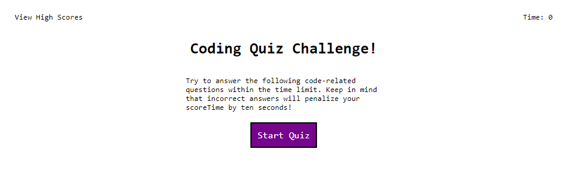

# code-challenge

Jisha Bhat's coding quiz

## Purpose
To create a webpage that executes a web development coding quiz

## User Story

```
AS A coding boot camp student
I WANT to take a timed quiz on JavaScript fundamentals that stores high scores
SO THAT I can gauge my progress compared to my peers
```

## Acceptance Criteria

```
GIVEN I am taking a code quiz
WHEN I click the start button
THEN a timer starts and I am presented with a question
WHEN I answer a question
THEN I am presented with another question
WHEN I answer a question incorrectly
THEN time is subtracted from the clock
WHEN all questions are answered or the timer reaches 0
THEN the game is over
WHEN the game is over
THEN I can save my initials and my score
```

## Usage

* Click "Start Quiz" to start the timed challenge
* If the time expires, the quiz is terminated
* If you get an answer incorrect, 10 seconds is deducted from the time remaining
* Click on an answer to select it
* A text label will inform you if your answer is correct
* When completed, you must enter you initials
* Click "Go Back" to restart the quiz
* Deployment - [coding challenge](https://bhatj.github.io/coding-challenge/)
* 